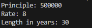
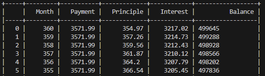
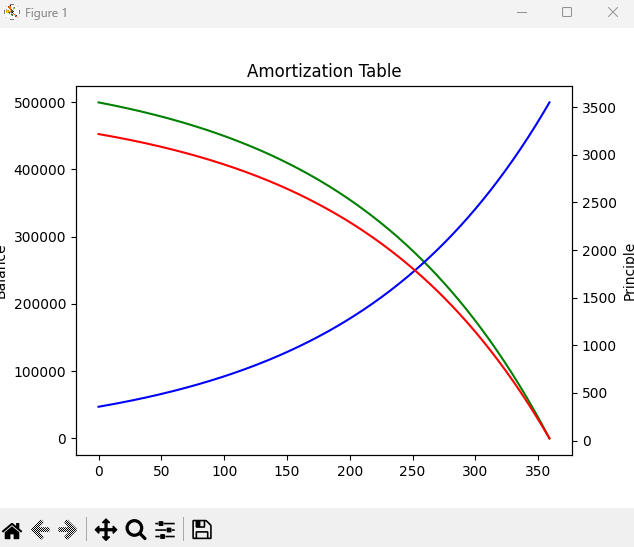

# amort
Amortization Table app

## Requirements
python3, pandas, matplotlib, seaborn

## Usage
Enter loan amount followed by interest rate followed by term of the loan in years

## Description
Output is a line graph showing balance, principle, and interest over time. After the chart is closed a dataframe is printed showing the payment schedule. This is assuming no extra payments are made. 

